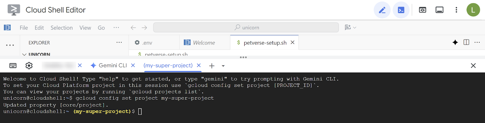
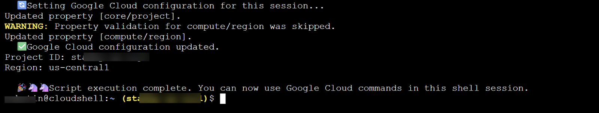

# 4. Create a helper script
To make this experience smoother, you will create a helper script that sets relevant environment variables.

Replace the <<Project ID>> with your project ID below.

Copy the following command into the Cloud Shell terminal and press Enter to execute**.**

```
gcloud config set project <<PROJECT_ID>>
```
> [!TIP]
> Use Ctrl/Command +Shift + V to paste into the console and Ctrl/Command +Shift + to copy.




Copy the following command into the Cloud Shell terminal and press Enter to execute**.** This will enable necessary services and create the file and edit it in the Cloud Shell.

```
gcloud services enable compute.googleapis.com \
                       cloudresourcemanager.googleapis.com \
                       aiplatform.googleapis.com \
                       storage-component.googleapis.com  \
                       bigqueryconnection.googleapis.com \
run.googleapis.com \
secretmanager.googleapis.com \
cloudbuild.googleapis.com \
artifactregistry.googleapis.com  \
iap.googleapis.com
edit  ~/petverse-setup.sh
```
You should see a new tab with the name of the file. Paste the following script into the new file:

```
#!/bin/bash

# -----------------------------------------------------------------------------
# 1. Global Variables: Set your desired project ID and region here.
# -----------------------------------------------------------------------------

# 🦄 🦄 Set your project ID here ⬇️.

# Example: PROJECT_ID="your-project-id"
PROJECT_ID=""

# Set your desired region here. Default is 'us-central1'.
# Example: REGION="us-east1"
REGION="asia-southeast3"

# -----------------------------------------------------------------------------
# 2. Check and Authenticate
# -----------------------------------------------------------------------------

echo "  ➡️   Checking for active Google Cloud authentication..."

# Check if the user is authenticated; if not, prompt for authentication.
if ! gcloud auth list --format="value(account)" | grep -q @; then
  echo "⚠️   Not authenticated. Please authenticate now."
  gcloud auth login
fi

echo "  ✅   Authentication check passed."

# -----------------------------------------------------------------------------
# 3. Get Project ID from User if not set
# -----------------------------------------------------------------------------

# If PROJECT_ID is not set in the script or as an environment variable,
# prompt the user to choose one.
if [[ -z "$PROJECT_ID" ]] && [[ -n "$DEVSHELL_PROJECT_ID" ]]; then
  PROJECT_ID=$DEVSHELL_PROJECT_ID
fi

if [[ -z "$PROJECT_ID" ]]; then
  echo "  ⚠️   Project ID is not set. Listing available projects:"
 
  # List projects and store them in an array.
  projects_array=($(gcloud projects list --format="value(projectId)"))
 
  # Check if projects were found.
  if [[ ${#projects_array[@]} -eq 0 ]]; then
    echo "  ❌   No projects found. Please ensure your account has access to projects."
    exit 1
  fi
 
  # Display the projects and prompt for input.
  echo " "
  echo "Available Projects:"
  for project in "${projects_array[@]}"; do
    echo "$project"
  done
 
  echo " "
  read -p "Please enter your desired project ID from the list above: " PROJECT_ID
 
  # Validate the user's input by checking if it's in the array.
  if [[ ! " ${projects_array[@]} " =~ " ${PROJECT_ID} " ]]; then
    echo "  ❌   Invalid project ID. Please run the script again and select a valid ID."
    exit 1
  fi
fi

echo "  ✅   Project ID set to: $PROJECT_ID"

# -----------------------------------------------------------------------------
# 4. Set Environment Variables
# -----------------------------------------------------------------------------

# Set the project and region for the current session.
echo "  🔄   Setting Google Cloud configuration for this session..."
gcloud config set project "$PROJECT_ID"
gcloud config set compute/region "$REGION"

echo "  ✅   Google Cloud configuration updated."
echo "Project ID: $PROJECT_ID"
echo "Region: $REGION"
echo " "
echo "  🎉 🦄 🦄   Script execution complete. You can now use Google Cloud commands in this shell session."
```


Copy the following command and execute in the terminal:

```
chmod +x petverse-setup.sh
~/petverse-setup.sh
```

Expected output:


