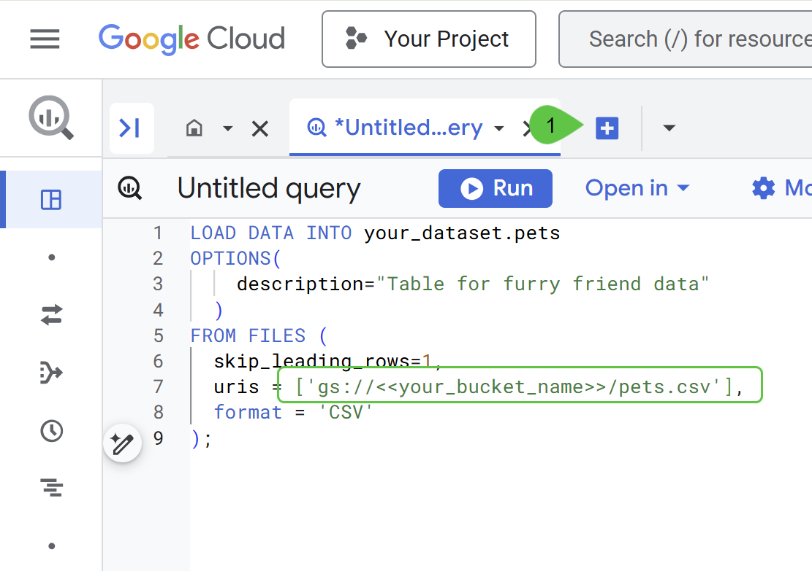
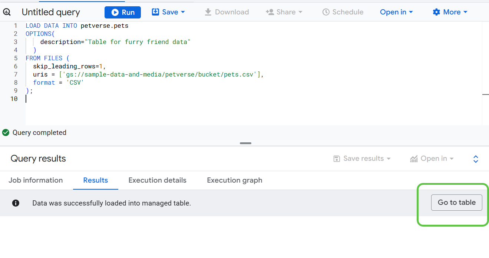
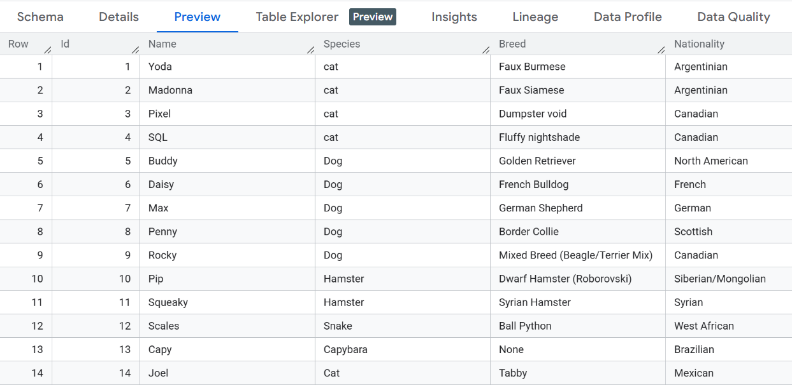

# 6. Create the pets table
You will now create a table in BigQuery to store information about your pets.

Open a new tab in the browser. Navigate to https://console.cloud.google.com/bigquery .

Make sure the same project you have been using is selected in the console:


You can now create a table using the data in the file pets.csv. This file contains the names, favorite foods, toys and other interesting information about our pets.

Copy the following code into a new SQL query to create a physical table and load the data.


```sql
LOAD DATA INTO petverse.pets
OPTIONS(
    description="Table for furry friend data"
  )
FROM FILES (
  skip_leading_rows=1,
  uris = ['gs://<<your_bucket_name>>/pets.csv'],
  format = 'CSV'
);
```

Replace the placeholder for the bucket in the code with the bucket you created in the previous step.

You can check all your storage buckets in a separate browser tab pointed to this URL: https://console.cloud.google.com/storage/browser .



Use the Run button to execute the query.

Once the data is loaded successfully, click Go to table.


Click Preview to see the contents of the table.


> [!NOTE]
> 🐱 : If you added a profile picture of your pet in the previous step, you will need to manually insert a record for them. Open a SQL editor and update the insert statement:
>
> INSERT INTO your_dataset.your_table ( Id, Name, Species, Breed, Nationality, Nicknames, Hobby, AdoptionStory, FavoriteFood, FavoriteToy)
> 
> VALUES (
> 
> @Id,
> 
> @Name,
> 
> @Species,
> 
> @Breed,
> 
> @Nationality,
> 
> @Nicknames,
> 
> @Hobby,
> 
> @AdoptionStory,
> 
> @FavoriteFood,
> 
> @FavoriteToy
> 
> );