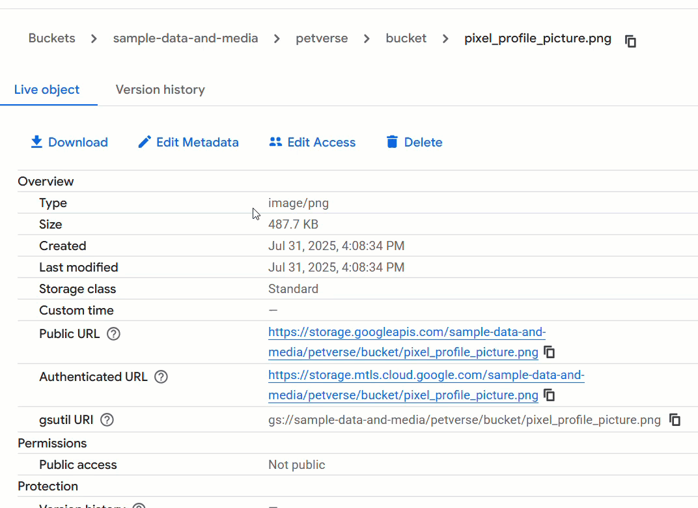
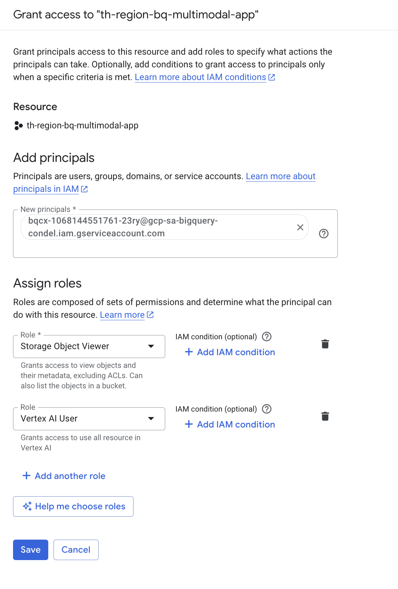
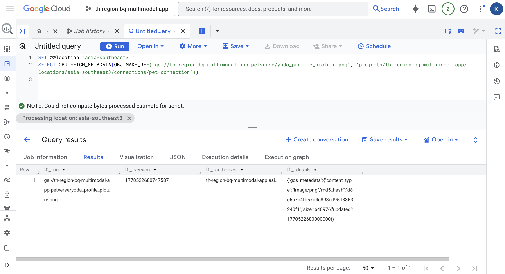

# 7. Connect BigQuery to the Storage Bucket
If you look in the bucket you created earlier, you will find a set of media files related to each pet.



BigQuery has the capability to read into these buckets and use the files alongside data in tables. This value type is called ObjectRef.

Get the service account id for the connection you created earlier by clicking on it under External connections.


Copy the service account id.

Navigate to the IAM Admin console in a new browser tab ( https://console.cloud.google.com/iam-admin/ ).

Grant the service account with Storage Object Viewer and Vertex AI User (you will use this permission later).


Click Save and 🕰️ wait a couple of minutes.

Back in the BigQuery tab, use the following query in BigQuery studio to test the connection between BigQuery and the storage bucket.

Replace <<PROJECT_ID>> with your project ID.


```sql
SET @@location='asia-southeast3';
SELECT OBJ.FETCH_METADATA(OBJ.MAKE_REF('gs://<<PROJECT_ID>>-petverse/yoda_profile_picture.png', 'projects/<<PROJECT_ID>>/locations/asia-southeast3/connections/pet-connection'))
```
Click View Results. You should get the metadata in the results:



> [!IMPORTANT]
> ⚠️ : If you see any errors, please correct them before continuing