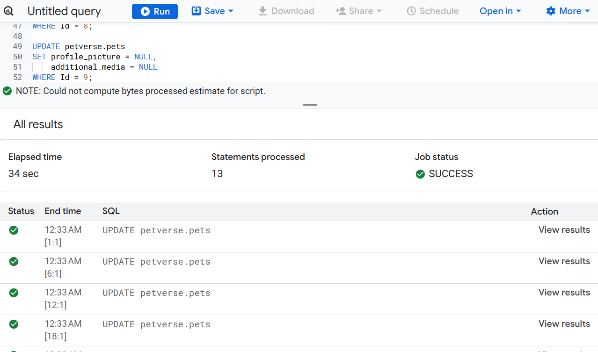
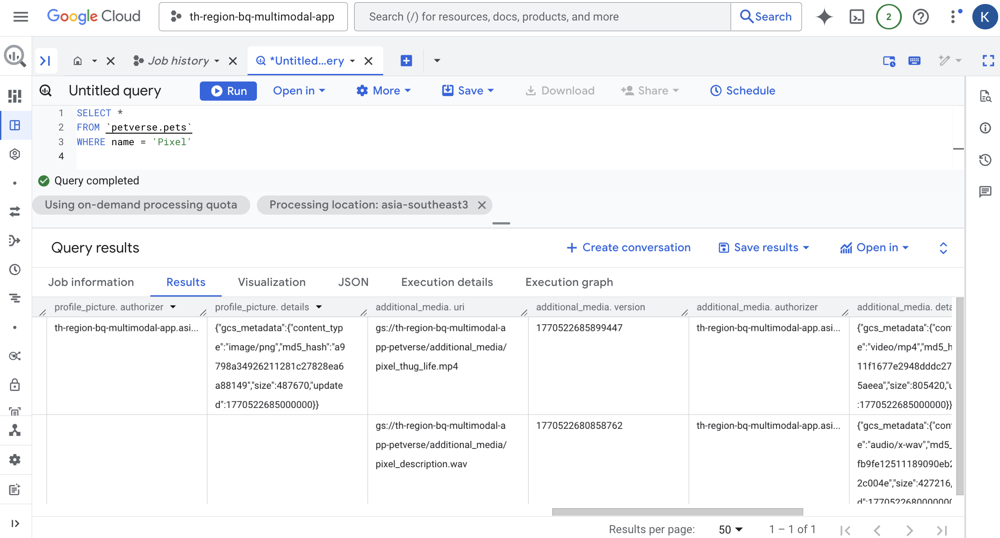

# 8. Add the storage media to your structured data
You can enhance the pets table to add a column with each pet's profile picture where available. You will also add another column with an array of media references, to hold all the other files related to each pet.

The access to the multimedia requires a connection, which you created in the beginning of this codelab after creating your bucket.

Paste the following commands into a BigQuery SQL console and execute them to add two columns to your pets table.

```sql
ALTER TABLE petverse.pets
ADD COLUMN IF NOT EXISTS profile_picture STRUCT<uri STRING, version STRING, authorizer STRING, details JSON>,
ADD COLUMN IF NOT EXISTS additional_media ARRAY<STRUCT<uri STRING, version STRING, authorizer STRING, details JSON>>;
```
Copy the following statements and replace the place holder for PROJECT_ID with your project id.

> [!TIP]
> 💡 : Use Ctrl/Command + H to replace all values


```sql
SET @@location='asia-southeast3';

UPDATE petverse.pets
SET profile_picture = (SELECT OBJ.FETCH_METADATA(OBJ.MAKE_REF('gs://<your_project_id>-petverse/yoda_profile_picture.png', 'projects/<your_project_id>/locations/asia-southeast3/connections/pet-connection'))),
    additional_media = [(SELECT OBJ.FETCH_METADATA(OBJ.MAKE_REF('gs://<your_project_id>-petverse/additional_media/Yoda_asks_for_cuddles.mp4', 'projects/<your_project_id>/locations/asia-southeast3/connections/pet-connection')))]
WHERE Id = 1;

UPDATE petverse.pets
SET profile_picture = (SELECT OBJ.FETCH_METADATA(OBJ.MAKE_REF('gs://<your_project_id>-petverse/madonna_profile_picture.jpg', 'projects/<your_project_id>/locations/asia-southeast3/connections/pet-connection'))),
    additional_media = [(SELECT OBJ.FETCH_METADATA(OBJ.MAKE_REF('gs://<your_project_id>-petverse/additional_media/Madonna_description.wav', 'projects/<your_project_id>/locations/asia-southeast3/connections/pet-connection')))]
WHERE Id = 2;

UPDATE petverse.pets
SET profile_picture = (SELECT OBJ.FETCH_METADATA(OBJ.MAKE_REF('gs://<your_project_id>-petverse/pixel_profile_picture.png', 'projects/<your_project_id>/locations/asia-southeast3/connections/pet-connection'))),
    additional_media = [(SELECT OBJ.FETCH_METADATA(OBJ.MAKE_REF('gs://<your_project_id>-petverse/additional_media/pixel_thug_life.mp4', 'projects/<your_project_id>/locations/asia-southeast3/connections/pet-connection'))),
                       (SELECT OBJ.FETCH_METADATA(OBJ.MAKE_REF('gs://<your_project_id>-petverse/additional_media/pixel_description.wav', 'projects/<your_project_id>/locations/asia-southeast3/connections/pet-connection')))]
WHERE Id = 3;

UPDATE petverse.pets
SET profile_picture = (SELECT OBJ.FETCH_METADATA(OBJ.MAKE_REF('gs://<your_project_id>-petverse/sql_profile_picture.png', 'projects/<your_project_id>/locations/asia-southeast3/connections/pet-connection'))),
    additional_media = [(SELECT OBJ.FETCH_METADATA(OBJ.MAKE_REF('gs://<your_project_id>-petverse/additional_media/SQL_description.wav', 'projects/<your_project_id>/locations/asia-southeast3/connections/pet-connection'))),
                       (SELECT OBJ.FETCH_METADATA(OBJ.MAKE_REF('gs://<your_project_id>-petverse/additional_media/SQL_favorite_toy.mp4', 'projects/<your_project_id>/locations/asia-southeast3/connections/pet-connection')))]
WHERE Id = 4;

UPDATE petverse.pets
SET profile_picture = (SELECT OBJ.FETCH_METADATA(OBJ.MAKE_REF('gs://<your_project_id>-petverse/buddy_golden_retriever.png', 'projects/<your_project_id>/locations/asia-southeast3/connections/pet-connection'))),
    additional_media = NULL
WHERE Id = 5;

UPDATE petverse.pets
SET profile_picture = (SELECT OBJ.FETCH_METADATA(OBJ.MAKE_REF('gs://<your_project_id>-petverse/daisy_french_bulldog.png', 'projects/<your_project_id>/locations/asia-southeast3/connections/pet-connection'))),
    additional_media = NULL
WHERE Id = 6;

UPDATE petverse.pets
SET profile_picture = (SELECT OBJ.FETCH_METADATA(OBJ.MAKE_REF('gs://<your_project_id>-petverse/max_german_shepherd.png', 'projects/<your_project_id>/locations/asia-southeast3/connections/pet-connection'))),
    additional_media = [(SELECT OBJ.FETCH_METADATA(OBJ.MAKE_REF('gs://<your_project_id>-petverse/additional_media/max_description_tells_jokes.mp4', 'projects/<your_project_id>/locations/asia-southeast3/connections/pet-connection')))]
WHERE Id = 7;

UPDATE petverse.pets SET profile_picture = NULL, additional_media = NULL WHERE Id = 8;

UPDATE petverse.pets SET profile_picture = NULL, additional_media = [(SELECT OBJ.FETCH_METADATA(OBJ.MAKE_REF('gs://<your_project_id>-petverse/additional_media/rocky_description.mp4', 'projects/<your_project_id>/locations/asia-southeast3/connections/pet-connection')))] WHERE Id = 9;

UPDATE petverse.pets
SET profile_picture = (SELECT OBJ.FETCH_METADATA(OBJ.MAKE_REF('gs://<your_project_id>-petverse/pip_hamster.png', 'projects/<your_project_id>/locations/asia-southeast3/connections/pet-connection'))),
    additional_media = [(SELECT OBJ.FETCH_METADATA(OBJ.MAKE_REF('gs://<your_project_id>-petverse/additional_media/pip_Hamster_Wheel_Video_Generated.mp4', 'projects/<your_project_id>/locations/asia-southeast3/connections/pet-connection')))]
WHERE Id = 10;

UPDATE petverse.pets SET profile_picture = NULL, additional_media = NULL WHERE Id = 11;

UPDATE petverse.pets
SET profile_picture = (SELECT OBJ.FETCH_METADATA(OBJ.MAKE_REF('gs://<your_project_id>-petverse/scales_snake.png', 'projects/<your_project_id>/locations/asia-southeast3/connections/pet-connection'))),
    additional_media = NULL
WHERE Id = 12;

UPDATE petverse.pets SET profile_picture = NULL, additional_media = NULL WHERE Id = 13;

UPDATE petverse.pets
SET profile_picture = (SELECT OBJ.FETCH_METADATA(OBJ.MAKE_REF('gs://<your_project_id>-petverse/Joel_Profile_Picture.jpg', 'projects/<your_project_id>/locations/asia-southeast3/connections/pet-connection'))),
    additional_media = [(SELECT OBJ.FETCH_METADATA(OBJ.MAKE_REF('gs://<your_project_id>-petverse/additional_media/Joel_Catwalk.jpg', 'projects/<your_project_id>/locations/asia-southeast3/connections/pet-connection'))),
                       (SELECT OBJ.FETCH_METADATA(OBJ.MAKE_REF('gs://<your_project_id>-petverse/additional_media/Joel_Flowers.jpg', 'projects/<your_project_id>/locations/asia-southeast3/connections/pet-connection'))),
                       (SELECT OBJ.FETCH_METADATA(OBJ.MAKE_REF('gs://<your_project_id>-petverse/additional_media/Joel_Plays.jpg', 'projects/<your_project_id>/locations/asia-southeast3/connections/pet-connection')))]
WHERE Id = 14;
```
> [!NOTE]
>  🐱 : If you added your own pet, add a statement to reflect the additional media for its id here.

Run the statement. You should see successful executions after a few minutes:



Check the results using the table preview. You should see the metadata for existing profile pictures and additional media for the cat called Pixel.

```sql
SELECT *
FROM `petverse.pets`
WHERE name = 'Pixel'
```


