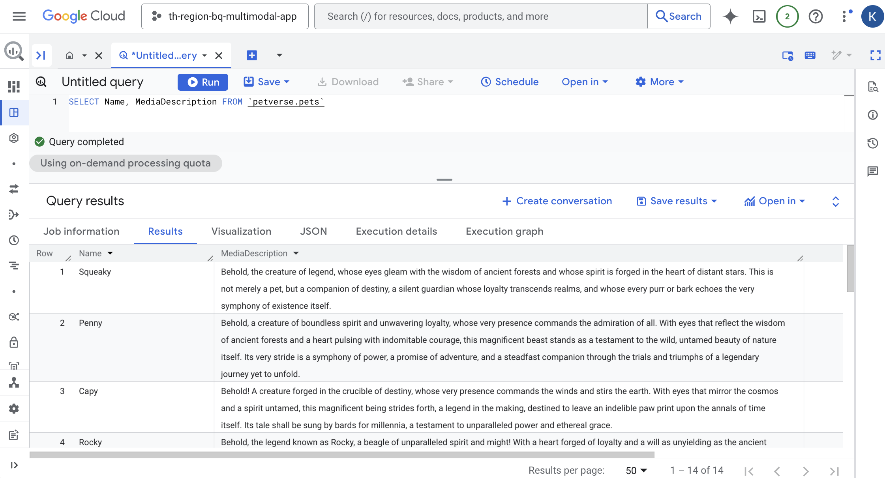

# 9. Generate descriptions of pets
If you preview the pets table, you will notice that some pets - like Yoda, Pixel or Rocky - are missing their favorite food or favorite toy.

The answers to these questions may be in the videos and audios related to these pets. You will use embedded AI functions to check.

Test this with the following statement:

```
SELECT 'What are this pet\'s favorite toy and favorite foods', additional_media 
FROM petverse.pets
```

```
SELECT name,
AI.GENERATE(
   prompt=> ('What are this pet\'s favorite toy and favorite foods', additional_media ),
    connection_id => 'asia-southeast3.pet-connection',
    endpoint => 'https://aiplatform.googleapis.com/v1/projects/<your_project_id>/locations/global/publishers/google/models/gemini-2.5-flash',
output_schema => 'food STRING, toy STRING')
FROM petverse.pets
WHERE name = 'Rocky'

```

or if you would like to try Gemini 3 Flash Preview
```
SELECT name,
AI.GENERATE(
   prompt=> ('What are this pet\'s favorite toy and favorite foods', additional_media ),
    connection_id => 'asia-southeast3.pet-connection',
    endpoint => 'https://aiplatform.googleapis.com/v1/projects/<your_project_id>/locations/global/publishers/google/models/gemini-3-flash-preview',
output_schema => 'food STRING, toy STRING')
FROM petverse.pets
WHERE name = 'Rocky'
```
You can see Rocky's video in your storage bucket.

Use the following statement to update the missing descriptions:


```
UPDATE petverse.pets AS p
SET FavoriteFood = aigen.food
FROM
  (
    SELECT Id, name,
          AI.GENERATE(
                prompt=> ('What are this pet\'s favorite toy and favorite foods', additional_media ),
                connection_id => 'asia-southeast3.pet-connection',
                endpoint => 'https://aiplatform.googleapis.com/v1/projects/<your_project_id>/locations/global/publishers/google/models/gemini-2.5-flash',
                output_schema => 'food STRING').food
    FROM petverse.pets ) AS  aigen
WHERE p.Id = aigen.Id
AND p.FavoriteFood IS NULL
AND p.additional_media IS NOT NULL

```
Use the following statement to create a description of the pets based on their multimedia into a new column:


```
ALTER TABLE petverse.pets ADD COLUMN MediaDescription STRING;
UPDATE petverse.pets AS p
SET MediaDescription = aigen.description
FROM
  (
    SELECT Id, name,
          AI.GENERATE(
                prompt=> ('Create a description in an epic tone for this pet based on these media: ', additional_media ),
                connection_id => 'asia-southeast3.pet-connection',
                endpoint => 'https://aiplatform.googleapis.com/v1/projects/<your_project_id>/locations/global/publishers/google/models/gemini-2.5-flash',
                output_schema => 'description STRING').description
    FROM petverse.pets ) AS  aigen
WHERE p.Id = aigen.Id
AND p.MediaDescription IS NULL
AND p.additional_media IS NOT NULL
```
You should see some creative descriptions after a few minutes:


> [!NOTE]
> Fun fact 📝: Madonna's audio file is in Spanish.

