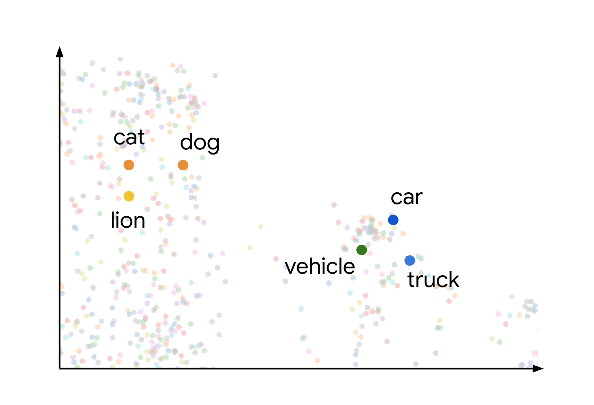
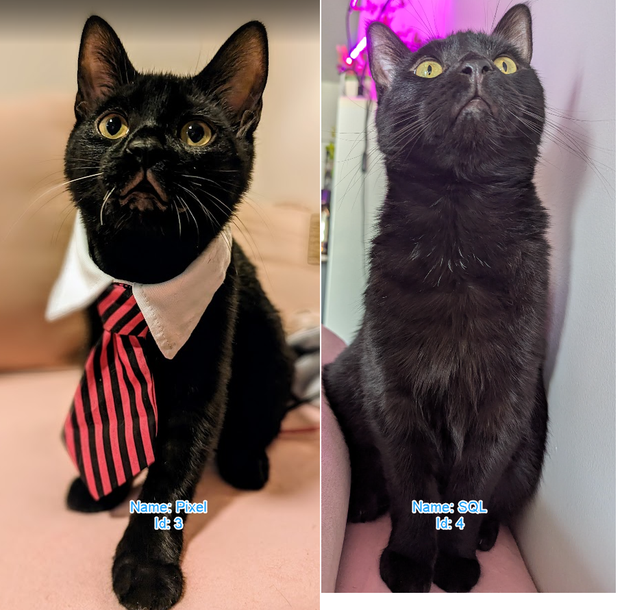
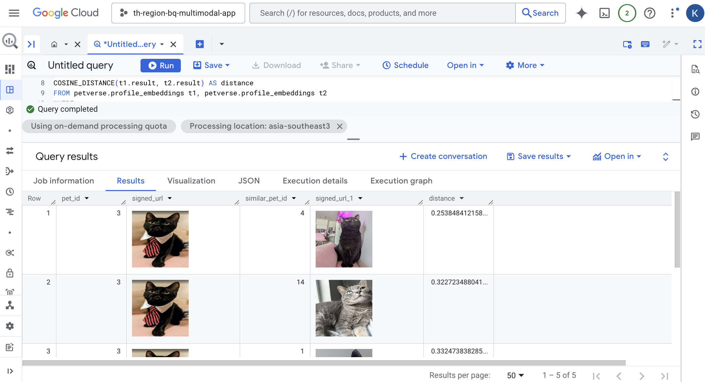
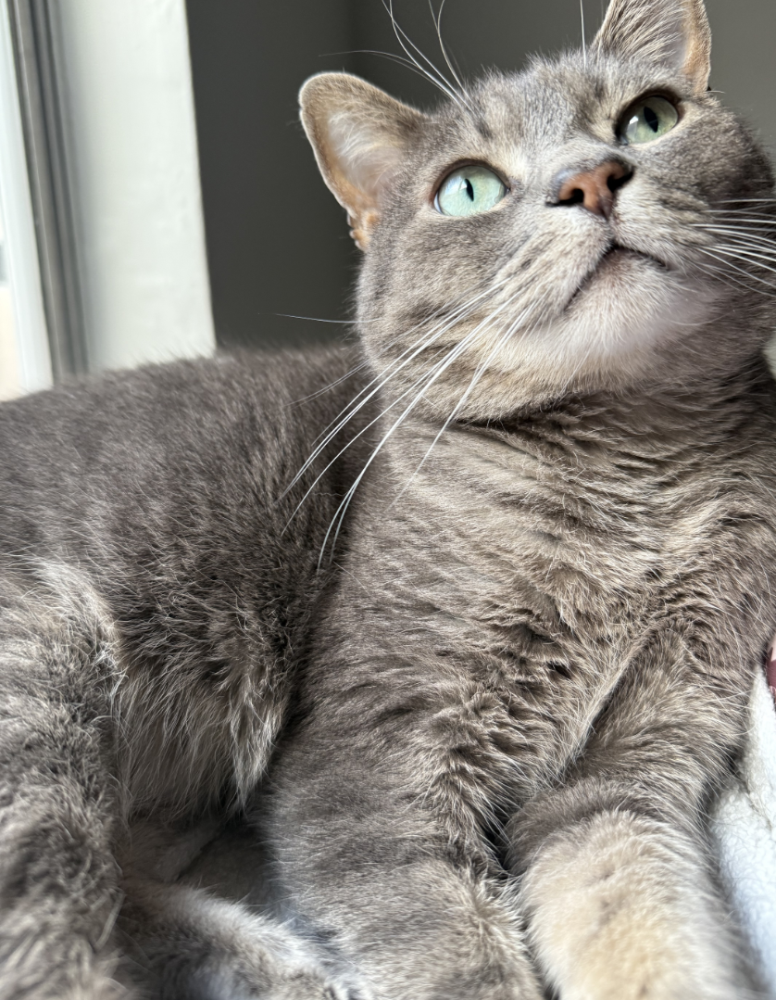

# 10. Create embeddings
Create a table to store the embeddings for the profile pictures and for the descriptions and hobbies to use in a semantic search. We will find similarities within pets using vector searches.


## Create embeddings for profile pictures
```
CREATE OR REPLACE TABLE petverse.profile_embeddings
AS
SELECT
 AI.EMBED(
   profile_picture,
   endpoint => 'https://aiplatform.googleapis.com/v1/projects/<your_project_id>/locations/asia-southeast1/publishers/google/models/multimodalembedding@001',
   connection_id => 'asia-southeast3.pet-connection').result,
 profile_picture,
 Id
FROM petverse.pets;
```
Check the new table from the results tab.


## Create embeddings for text
```
CREATE OR REPLACE TABLE petverse.text_embeddings
AS
SELECT embedding_result.result as embedding_result, content, Id, Name
FROM
 (
   SELECT
     AI.EMBED(
       content,
       endpoint =>
         'https://aiplatform.googleapis.com/v1/projects/<your_project_id>/locations/asia-southeast1/publishers/google/models/text-embedding-005')
       AS embedding_result,
     content,
     Id,
     Name
   FROM
     (
       SELECT
         CONCAT(
           AdoptionStory,
           ' . This pet\'s hobby is: ',
           Hobby,
           ' and their nickname(s) is: ',
           COALESCE(Nicknames, Name)) AS content,
         Id,
         Name
       FROM petverse.pets
       WHERE LENGTH(AdoptionStory) > 0 AND LENGTH(Hobby) > 0
     )
 )
WHERE length(embedding_result.status) = 0
```


## Look for similar pets
The default dataset has similar pets in it. Here are two examples Pixel (Id: 3) and SQL (Id: 4):




You can use the distance between the embeddings to calculate similar pets:


```

SELECT 
t1.id AS pet_id,
 STRING(OBJ.GET_ACCESS_URL(t1.profile_picture,'r').access_urls.read_url) AS signed_url,
 
t2.id AS similar_pet_id,
 STRING(OBJ.GET_ACCESS_URL(t2.profile_picture,'r').access_urls.read_url) AS signed_url,

COSINE_DISTANCE(t1.result, t2.result) AS distance
FROM petverse.profile_embeddings t1, petverse.profile_embeddings t2
WHERE
t1.Id = 3 -- The pet you want to find similar ones to
AND t1.Id != t2.Id -- Exclude the pet itself from the results
AND t1.profile_picture.uri IS NOT NULL
AND t2.profile_picture.uri IS NOT NULL
ORDER BY
distance
LIMIT 5;

```
You should get results with the Ids of pictures that are similar to each other. This will include everything in the picture. In this example, Pixel and SQL are similar, and the next most similar pet is Joel (Id: 14).


Here's a picture of Joel for reference:

    

## Try semantic search
You can use the VECTOR_SEARCH function to semantically search across text embeddings. If this table was larger, you would need to create and index for the embeddings.
```
SELECT query.query, base.content, base.Name
FROM
 VECTOR_SEARCH(
   TABLE `petverse.text_embeddings`,
   'embedding_result',
   (
     SELECT embedding_result.result as embedding_result, query
     FROM
       (
         SELECT
           AI.EMBED(
             content,
             endpoint =>
               'https://aiplatform.googleapis.com/v1/projects/<your_project_id>/locations/asia-southeast1/publishers/google/models/text-embedding-005')
             AS embedding_result,
           content AS query
         FROM (SELECT 'Pets who like to relax' AS content,)
       )
   ),
   top_k => 5,
   options => '{"fraction_lists_to_search": 0.50}')
ORDER BY distance DESC

```
Try changing the semantic search term (`Pets who like to relax`) as well as the parameter `fraction_lists_to_search` and see what happens. You can learn more about these functions [here](https://cloud.google.com/bigquery/docs/reference/standard-sql/search_functions#vector_search).

